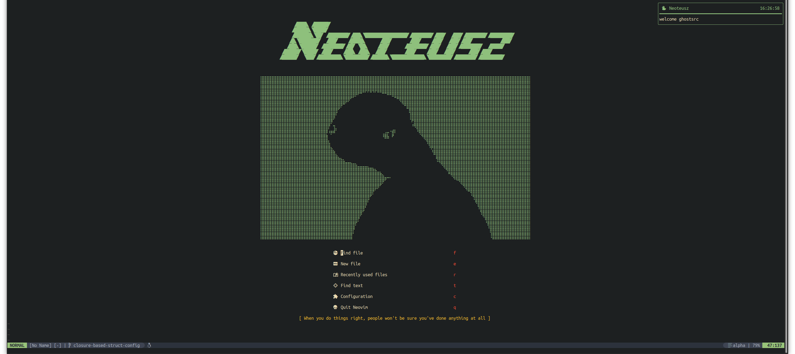

## Neoteusz - Get S#@% done with Neovim!

Neoteusz is a streamlined yet powerful Neovim configuration designed for developers who value speed and efficiency, this configuration offers a blazingly-fast, responsive developer experience. Instantly navigate large codebases, run complex commands, and interact seamlessly with Neovim; all while maintaining a low resource footprint.

Whether you're working on large projects or quick scripts, this setup helps your workflow remain smooth and distraction free, empowering you to focus on building the things that you enjoy.

Thank you for stopping by and have fun!


## 📋 Note

Version `1.x.x` of Neoteusz leveraged [packer.nvim](https://github.com/wbthomason/packer.nvim) as the package manager; however, packer is no longer actively maintained. `v2.x.x` and beyond will leverage [lazy.nvim](https://github.com/folke/lazy.nvim/tree/stable) as the defacto package manager (unless stated otherwise).

In addition, it should be noted that this configuration and the instructions outlined, were implemented on a `Ubuntu 24.04 LTS (Noble Numbat)` system using a `v0.9.4` neovim app image; instructions may need to be tailored for other linux distributions or neovim versions.


## 🔌 Plugin Inventory

- [lazy.nvim](https://github.com/folke/lazy.nvim):
    - `lazy.nvim` is a modern plugin manager for Neovim.

- [gruvbox](https://github.com/morhetz/gruvbox)
  - `gruvbox`, the color scheme is known for its warm and retro-inspired color palette, which many developers find visually pleasing and comfortable for coding. It often includes variations for different languages and file types to make syntax highlighting more readable and aesthetically pleasing.

- [alpha-nvim](https://github.com/goolord/alpha-nvim)
  - `alpha` a fast and fully programmable dashbboard plugin for neovim
 
- [akinsho/bufferline.nvim](https://github.com/akinsho/bufferline.nvim)
  - `bufferline` is a popular Neovim plugin that provides a customizable and feature-rich buffer/tabline for managing open buffers in Neovim. It enhances the visual representation of buffers in Neovim, making it easier to navigate and manage multiple open files.

- [lukas-reineke/indent-blankline.nvim](https://github.com/lukas-reineke/indent-blankline.nvim)
  - `indent-blankline.nvim` is a plugin is designed to enhance the visibility of indentation levels within your code or text documents.

- [nvim-treesitter](https://github.com/nvim-treesitter/nvim-treesitter)
  - `treesitter` is a parser generator tool and an incremental parsing library
    It can build a concrete syntax tree for a source file and efficiently update the syntax tree as the source file is edited
  - **_nvim-treesitter is required for IDE functionality such as parsing, syntax highlighting, code analysis and incremental selection_**

- [nvim-telescope/telescope.nvim](https://github.com/nvim-telescope/telescope.nvim)
  - `telescope` is a highly extendable fuzzy finder over lists. Built on the latest awesome features from neovim core

- [ThePrimeagen/harpoon](https://github.com/ThePrimeagen/harpoon)
  - `harpoon` is a productivity plugin for Neovim that aims to help developers quickly navigate between files, terminals, and marks within their development environment. It provides a way to create shortcuts to frequently accessed resources, making it faster and more convenient to switch between different parts of a project.

- [folke/flash.nvim](https://github.com/folke/flash.nvim)
  - `flash` lets you navigate your code with search labels, enhanced character motions, and Treesitter integration.

- [BurntSushi/ripgrep](https://github.com/BurntSushi/ripgrep)
  - `ripgrep`, also known as rg, is a line-oriented search tool that recursively searches your current directory for a regex pattern. It is developed by Andrew Gallant (also known by his GitHub handle BurntSushi) and is written in Rust. `ripgrep` is similar to other search tools like ack and ag (The Silver Searcher), but it is typically faster.

- [sharkdp/fd](https://github.com/sharkdp/fd)
  - `fd` is a fast and user-friendly alternative to the traditional find command that comes with Unix and Linux operating systems. Developed by David Peter (sharkdp), it's written in Rust, making it highly efficient and fast.

- [jackMort/ChatGPT.nvim](https://github.com/jackMort/ChatGPT.nvim)
  - `ChatGPT` is a Neovim plugin that allows you to effortlessly utilize the OpenAI ChatGPT API, empowering you to generate natural language responses from OpenAI's ChatGPT directly within the editor in response to your inquiries.

- [MunifTanjim/nui.nvim"](https://github.com/MunifTanjim/nui.nvim)
  - `nui` is a plugin for Neovim, and it's a highly customizable UI component framework based on Lua. This plugin aims to provide developers with components such as prompts, menus, and dialogs to help build interactive user interfaces within Neovim.

- [nvim-lua/plenary.nvim](https://github.com/nvim-lua/plenary.nvim)
  - `plenary` is a neovim library that provides lua functions required for the development and use of various neovim plugins.

- [nvim-lualine/lualine.nvim](https://github.com/nvim-lualine/lualine.nvim)
  - `lualine` is a blazing fast and easy to configure neovim statusline written in Lua.

- [nvim-tree/nvim-web-devicons](https://github.com/nvim-tree/nvim-web-devicons)
  - `nvim-web-devicons` is a lua fork of vim-devicons. This plugin provides the same icons as well as colors for each icon.

- [fatih/vim-go](https://github.com/fatih/vim-go)
  - `vim-go` is a plugin for the Vim text editor, specifically aimed at providing an enhanced environment for developing Go.
    the plugin is developed to augment Vim with Go development features and tools, enabling a powerful and integrated workflow for Go development within the Vim environment.

- [mfussenegger/nvim-dap](https://github.com/mfussenegger/nvim-dap)
  - `nvim-dap` is a generic protocol for neovim that will interface with various debuggers.

- [rcarriga/nvim-dap-ui](https://github.com/rcarriga/nvim-dap-ui)
  - `dapui` is a User Interface (UI) for nvim-dap which provides a good out of the box configuration.
    
- [leoluz/nvim-dap-go](https://github.com/leoluz/nvim-dap-go)
  - `nvim-dap-go` is an extension for nvim-dap providing configurations for launching go debugger (delve) and debugging individual tests.

- [folke/neodev.nvim](https://github.com/folke/neodev.nvim)
  - `neodev` setup for init.lua and plugin development with full signature help, docs and completion for the nvim lua API.
  - It is highly recommended to use neodev to enable type checking for nvim-dap-ui to get type checking, documentation and autocompletion for all API functions.

- [mortepau/codicons.nvim](https://github.com/mortepau/codicons.nvim)
  - `codicons` is a small library containing the codicons from VS Code and some functions to simplify the usage of them.

- [neovim/nvim-lspconfig](https://github.com/neovim/nvim-lspconfig)
  - `nvim-lspconfig` is a configuration utility for the built-in Language Server Protocol (LSP) client for neovim. 
  - the Language Server Protocol is a standard for implementing programming language smart features, such as autocompletion, go to definition, and find references, by using language servers that communicate with development environment editors and IDEs.

- [williamboman/mason.nvim](https://github.com/williamboman/mason.nvim)
  - `mason` is a neovim plugin that allows you to easily manage external editor tooling such as LSP servers, DAP servers, linters, and formatters through a single interface.

- [williamboman/mason-lspconfig.nvim](https://github.com/williamboman/mason-lspconfig.nvim)
  - `mason-lspconfig` bridges mason.nvim with the lspconfig plugin - making it easier to use both plugins together.
  - `mason-lspconfig`.nvim closes some gaps that exist between `mason` and `lspconfig`. 
  - `mason-lspconfig`'s main responsibilities are to:
    - register a setup hook with lspconfig that ensures servers installed with mason.nvim are set up with the necessary configuration
    - provide extra convenience APIs such as the :LspInstall command
    - allow you to (i) automatically install, and (ii) automatically set up a predefined list of servers
    - translate between lspconfig server names and mason.nvim package names (e.g. lua_ls <-> lua-language-server)

- [hrsh7th/nvim-cmp](https://github.com/hrsh7th/nvim-cmp)
  - `nvim-cmp` is a Neovim plugin developed by hrsh7th that provides a powerful and extensible auto-completion framework for Neovim. it is designed to be a completion engine for Neovim and is part of the Neovim ecosystem that has grown around its native support for the Language Server Protocol (LSP).

- [hrsh7th/cmp-nvim-lsp](https://github.com/hrsh7th/cmp-nvim-lsp)
  - `cmp-nvim-lsp` is a source (or completion provider) for the `hrsh7th/nvim-cmp` completion framework, specifically designed to integrate with Neovim's built-in LSP (Language Server Protocol) client. The LSP client communicates with language servers to provide intelligent code completion, diagnostics, and other language features.
  - `cmp-nvim-lsp` allows nvim-cmp to provide completion suggestions based on the information provided by the LSP, like variable names, methods, functions, and more relevant to the programming language you are working with.

- [hrsh7th/cmp-buffer](https://github.com/hrsh7th/cmp-buffer)
  - `cmp-buffer` is another source for the `hrsh7th/nvim-cmp` completion framework. While `hrsh7th/cmp-nvim-lsp` provides completion suggestions from Neovim’s built-in Language Server Protocol (LSP) client, `cmp-buffer` provides completion suggestions from the content of the currently open buffers. This means that `cmp-buffer` will suggest words and phrases that exist in your currently open buffers, regardless of whether they are recognized as symbols or identifiers by a language server. This can be useful when working with any kind of text, not just code, as it can suggest completions based on what you have already typed or have open in another buffer.

- [L3MON4D3/Luasnip](https://github.com/L3MON4D3/LuaSnip)
  - `Luasnip` is a snippet engine plugin for Neovim. It's a Lua-based, fast, and extensible snippet solution for Neovim that allows you to define and insert snippets of text quickly, enhancing coding efficiency. Snippets are small pieces of reusable code or text that you can insert into your files, and they often have placeholders that you can jump between and fill out.

- [windwp/nvim-autopairs](https://github.com/windwp/nvim-autopairs)
  - `autopairs` is designed to automatically close pairs of characters like parentheses, brackets, and quotes as you type, providing a smoother and faster coding experience.

- [akinsho/toggleterm.nvim](https://github.com/akinsho/toggleterm.nvim)
  - `toggleterm` is a Neovim plugin written in Lua, designed to help manage terminal windows within Neovim. The plugin allows users to toggle Neovim's built-in terminal easily, meaning you can show or hide the terminal window with a single command or key mapping.

- [numToStr/Comment.nvim](https://github.com/numToStr/Comment.nvim)
  - `Comment.nvim` is a Neovim plugin written in Lua, which provides an easy and efficient way to comment out lines of code in multiple programming languages. Commenting is a common task in coding, and this plugin helps automate and streamline the process. 

- [lewis6991/gitsigns.nvim](https://github.com/lewis6991/gitsigns.nvim)
  - `gitsigns` is a Neovim plugin designed to enhance the user's experience when working with Git repositories by providing signs in the 'signcolumn' (the area just left of the line numbers). These signs indicate changes relative to the Git index (staged changes). The plugin is written in Lua and is optimized for performance, making it a popular choice among Neovim users.

- [ibhagwan/fzf-lua](https://github.com/ibhagwan/fzf-lua)
  - `fzf` is a Neovim plugin that provides a Lua interface to the popular fzf fuzzy finder. fzf is a command-line tool that allows for interactive searching and filtering of lists, and it has been integrated into many editors and shells to provide enhanced fuzzy searching capabilities.

- [nvim-tree/nvim-tree.lua](https://github.com/nvim-tree/nvim-tree.lua)
  - `nvim-tree` is a popular file explorer plugin for Neovim, written in Lua. It provides a visual tree-like structure to navigate your file system, making it easier to browse, open, and manage files and directories directly from Neovim. This plugin is designed to be highly customizable and extendable, fitting seamlessly into a modern Neovim setup that utilizes Lua for configuration and plugins.


## 🚀 Language Severs, LSPs, Linters & Formatters

The base setup comes with a small number language servers enabled; however, you can easily extend the number of language servers with minimal effort. Simply update the `ensure_installed` lua table within the `mason-lspconfig` setup function to include the names of your desired language servers.

To view the currently installed language servers, simply enter the `:Mason` command within neovim.


>[!NOTE] 
>The list of available language servers can be observed within [mason-lspconfig documentation](https://github.com/williamboman/mason-lspconfig.nvim?tab=readme-ov-file#available-lsp-servers)

>[!TIP]
> The default configuration of language server should be automatically handled by `mason-lspconfig`; however, some language servers may also require an explicit `setup({})` call to properly initialize. 
>
>If LSP functionality is not working for a newly added language server, add an explicity setup call for the particular language server (e.g. ```lua lspconfig.<server>.setup({})``` ) within the `nvim-lspconfig` config function.


## 💻 Terminal UI (TUI) Integration - Extensions

Neoteusz comes baked with `toggleterm` ready implmentations for a couple of TUI apps. The respective TUI key bindings will only function if the underlying apps are installed. Once installed, simply use [which-key](#-key-bindings---which-key) to discover the appropriate key bindings and have fun with TUIs.

>[!TIP]
> The pattern used for the integration of TUIs with Neovim can be followed to add additional TUIs as desired. You may need to tweak things a little bit depending on how the TUI behaves; however, it shouldn't be too tricky.

- [jesseduffield/lazygit](https://github.com/jesseduffield/lazygit)
  - `lazygit` is a **_NOT_** a Neovim plugin, but rather a simple terminal UI for Git commands, built with Go. It offers a more visual and interactive way to manage and visualize Git repositories directly from the terminal, without needing to remember or type out individual Git commands.

- [derailed/k9s](https://github.com/derailed/k9s)
  - `k9s` is a popular open-source terminal-based console (TUI) for managing and interacting with Kubernetes clusters. It provides a powerful and convenient way to view, navigate, and manipulate Kubernetes resources and clusters directly from your terminal. K9s is designed to simplify Kubernetes administration tasks and provide real-time insights into your cluster.


## 📦 Nvim Config Environment Variables

 
 WHY do we have them???


 - `NVIM_LOG_LVL`: by setting this environment variable to either ["TRACE" | "DEBUG" | "INFO" | "WARN" | "ERROR" | "OFF" ], the [`rcarriga/nvim-notify`](https://github.com/rcarriga/nvim-notify) plugin will be configured to display notifications upto the desired log level. If the env var `NVIM_LOG_LVL` is not set, the log level is deafult to `INFO`.

 Neovim will open with debugging info, such as the compatible clipboard providers that have been detected, etc.
by setting this environment variable to `true`, Neovim will open with debugging info, such as the compatible clipboard providers that have been detected, etc.
</br>
 
 - `NVIM_SKIP_CLIP`: by setting this environment variable to `true`, you are choosing to skip the configuration of prefered clipboard providers (xclip, xsel, tmux, termux, etc...) and dismiss related errors.
</br>
 
 - `NVIM_CLIP`: Depending on your preference of clipboard provider for Neovim and your currently installed clipboard providers on your system, Neovim may implicitly select a provider and connect the respective registers. If you prefer not to leverage a clipboard like `xclip` or do not have a display (i.e. headless server), you can explictly select `tmux` as your prefered clipboard provider. 

   - To do so, set the `NVIM_CLIP` environment variable to `tmux`. This will configure `tmux` to be your preferred clipboard provider, connect the appropriate registers and set the `<leader> + y`, `<leader> + p` key bindings for copying and pasting, respectively.
 
   - <code style="color : green"><b>Note</b></code>**:** To see more information about clipboard configurations, please see the `Nvim Clipboard Provider Related` subsection of [Nvim Config Installation Prerequisites](#nvim-config-installation-prerequisites).
</br>
 
 - `NVIM_ENABLE_GPT`: by setting this environment variable to `true`, the `jackMort/ChatGPT.nvim` plugin will be able to be installed via `Lazy` upon Neovim restart. In addition, the respective key bindings outlined in the [Noteworthy Key Bindings](#noteworthy-key-bindings) section of this document will be bound.

    - <code style="color : green"><b>Note</b></code>**:** For more information regarding the `ChatGPT` plugin and its installation requirements, please see the respective subsection within [Nvim Config Installation Prerequisites](nvim-config-installation-prerequisites).
    </br>

- `NVIM_DISABLE_MATCHING_HL`: by setting this environment variable to `true`, you will be disabling all symbol match highlighting (e.g. matching open and closing brackets/braces). 
</br>

- `NVIM_ENABLE_BACKUP_COMMENT_COLOR`: This environment variable should **_ONLY_** be used when you are encountering issues with either treesitter or LSPs, where comments are no longer being rendered in green text.

  - To manually override the `gruvbox` colorscheme to render comments in green text, when either treesitter or LSPs are **_NON_**-FUNCTIONAL, set the environment variable to `true`.


## 🛠️ Requirements

### Required

- Neovim >= 0.9.4
- Git >= 2.19.0 (for partial clones support)
- A patched Nerd Font - To see how to patch fonts, refer to the [References Section](#references)

### Optional ###

- [jesseduffield/lazygit](https://github.com/jesseduffield/lazygit)

- [derailed/k9s](https://github.com/derailed/k9s)

- **ChatGPT Nvim Plugin Related**
  - If you would like use the `jackMort/ChatGPT.nvim` plugin to integrate neovim with the OpenAI's ChatGPT, there are a couple of prerequisites
    - you will need a valid OpenAI API Key
    - you will have to securely store said key - this will dictate how you configure the `chatgpt` setup config
      - if you would like to leverage an enviornment variable (env var), create an env var named `OPENAI_API_KEY` in your respective shell's _rc_ (i.e. Run Commands) file.
        - e.g.) `export OPENAI_API_KEY={SECRET_KEY}`
      - **_OTHERWISE_**, you can leverage password manager or keystore to store the API key and have the `chatgpt` plugin retrieve it a system command.
        - if you decide to go down this route, you will need to update the `chatgpt` setup config to invoke a command under the `api_key_cmd` config field. Examples below: <br /><br />

          The following configuration would use 1Passwords CLI, `op`, to fetch the API key from the `credential` field of the `OpenAI` entry.

          ```lua
          require("chatgpt").setup({
            -- example using the 1Password Secret Store CLI
            api_key_cmd = "op read op://private/OpenAI/credential --no-newline"
          })
          ```
          The following configuration would use `GPG` to decrypt a local file containing the
          API key.

          ```lua
          local home = vim.fn.expand("$HOME")
          require("chatgpt").setup({
              -- example using GPG
              api_key_cmd = "gpg --decrypt " .. home .. "/secret.txt.gpg"
          })
          ```


**Nvim Clipboard Provider Related**

  Neovim has no direct connection to the system clipboard. Instead it depends on a _provider_ which transparently uses shell commands to communicate with the system clipboard or any other clipboard backend 

  - The clipboard experience varies depending on if you are using a headless version of a linux distribution or one that supports a GUI.
    - **`XServer/GUI`:**
      - if you are using a linux distro that has a GUI compoment, you can leverage a more robust and user friendly clipboard provider like `xclip` or `xsel`.
      - The presence of a working clipboard tool such as  `xclip` or `xsel` will implictly enable the `+` and `*` registers. Basically just install xclip and neovim will automatically boostrap the clipboard provider allowing for automatiic integration.
      
    - **`Headless Linux Server`:**
      -  ATM the current config really only supports `tmux` as a clipboard provider for headless linux distros. Clipboard providers such as `xclip` and `xsel` will not function as there is no 'display' to hook into (XServer is not present), thus are not viable options.
      - if you are feeling savy, feel free into into other supported clipboard providers, which can support SSH forwarding and other functionality for headless
      linux servers.

  - It should be noted that the default behavior for `neovim` when it is invoked within a tmux session is to use the `tmux` _clipboard proivder_, unless a more suitable _provider_ is already installed (e.g. `xclip`, `xsel`).
    - If you want to use `tmux` as the clipboard provider regardless if you already have another clipboard provider installed, you can set the `NVIM_CLIP` environment variable to `tmux` in your respective rc file.
      ```bash
      # entry in your repsective rc file (e.g. ~/.bashrc)
      export NVIM_CLIP="tmux"
      ```

  - If you want nothing to do with the clipboard setup, ignore related config errors and allow neovim to implicitly handle things (which also could mean doing nothing), simply set the `NVIM_SKIP_CLIP` env var to `true` in your respective rc file.
    ```bash
    # entry in your repsective rc file (e.g. ~/.bashrc)
    export NVIM_SKIP_CLIP=true
    ```

  - to see more details regarding how neovim clipboard providers integrate with neovim and their respective functions, issue the `:help g:clipboard` command 


## 📋 Nvim Config Validation

After addressing [Nvim Config Installation Prerequisites](#nvim-config-installation-prerequisites), you should check the overall status of your neovim setup by excuting the `:checkhealth` command

The `:checkhealth` command runs a series of diagnostic tests to check the health of your Neovim installation. If it uncovers any problems, it usually offers suggestions on how to fix them, or where to go to learn more.
If you find and relvant *Warnings* which may impact your nvim setup or experience, OR any *Errors*, follow the guidance provide and address their resolution accordingly.


## 🔎 Key Bindings - Which Key
>[!NOTE]
> by default the leader key binding is set to the `<space>` key, feel free to change it ;)

which-key is used to ... 

**Leader Bound Key Bindings**
All keybindings tied to the leader key, are grouped into categories to help provide an intuitive navigation experience. I encourage you to explore the key bindings using `which-key` to get a better understanding of the custom key bindings that have been made available to you.


**Window Manipulation & Navigation**
Key bindings related to windows within nvim can still be observed using `which-key`, simply enter <C-w> (i.e. <ctrl> + b) and `which-key` will display all window related keybindings that are currently registered.


**Auto-Completion**
To allow for a seamless experience with auto-completion, related keys were not registered with `which-key`.

LIST HERE!


## 📚 References

- [Language Server Protocol (LSP)](https://microsoft.github.io/language-server-protocol)

- [Neovim LSP client configurations](https://github.com/neovim/nvim-lspconfig/blob/master/doc/server_configurations.md)

- [Nerd Fonts](https://www.nerdfonts.com/)
  - plugins such as `diffview`, `ChatGPT.nvim` are configured to use [Patched Fonts](https://github.com/ryanoasis/nerd-fonts#patched-fonts) for rendering icons within the terminal and ultimately Neovim.
  - [Github](https://github.com/ryanoasis/nerd-fonts)

- [Codicons](https://github.com/microsoft/vscode-codicons)
  - plugin(s) such as `nvim-dap-ui` are configured to use the `codicons` Font, as part of the UI's debugger pane.
  - the `codicons` font will required to be patched by tools like nerd-fonts' font-patcher; possibly in conjunction with fontforge. See the `How to Patch Fonts` subsection within `References` for details on how to deal with Font Patching.

- **_How to Patch Fonts_**:
    - Manually Patching a Font
      - [Font Patching Procedure](https://github.com/ryanoasis/nerd-fonts#option-9-patch-your-own-font)
      - Once a font is patched, move the respective `.ttf` file to the running user's font dir (e.g. `~/.local/share/fonts/FontName.ttf`) or in a well named subdirectory (e.g. `~/.local/share/fonts/Ubuntu/FontName.ttf`
    - Using already Patched Fonts
      - Dowload a patched font from [Nerd Fonts](https://www.nerdfonts.com/font-downloads)
      - Move the respective `.ttf` file(s) to the running user's font dir (e.g. `~/.local/share/fonts/FontName.ttf`) or in a well named subdirectory (e.g. `~/.local/share/fonts/Ubuntu/FontName.ttf`)

